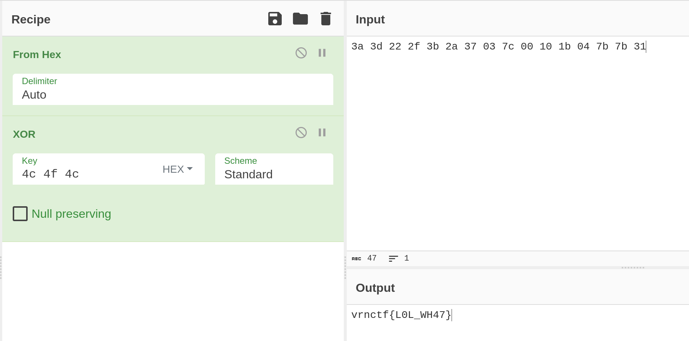

# Решение

1. Определить язык (гуглом по синтаксису - LOLCODE).

2. Разобраться в основных (и не только) обозначениях, которые используются в коде.

3. Понять что же задумывал "автор программы" - в переменных содержатся hex коды (это можно понять по `:(HEX_CODE)`), 
далее программа строит какой-то ключ (но там намеренно были допущенны некоторые ошибки (а конкретно в попытке вычесть число из строки), что показывается коментарием `BTW NO WORKS :(`).
Затем данным ключём пытаются поксорить (`WON`) текст, который строится конкатенацией строк из тех символов, которые заданы hex-кодами.

4. Выписать hex-коды и ключ (hex-код которого `4С 4F 4C`) куда-нибудь и воспользоваться удобным инструментом (CyberChef, например) для того, чтобы поксорить ключ на текст.

