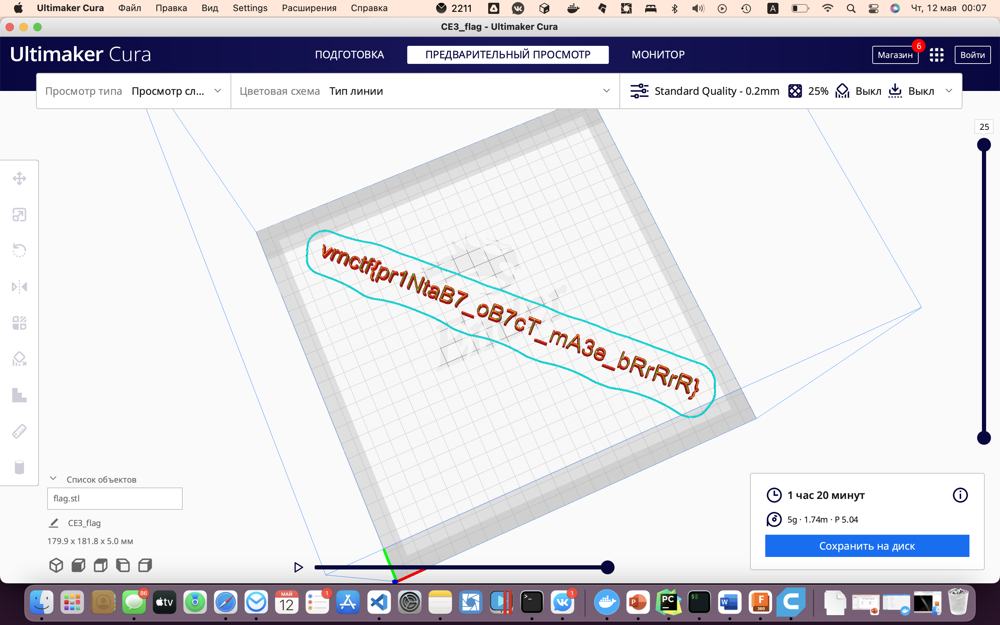

# Экзотический язык машин

## Информация 

> На этом языке деды-инженеры на заводе общались, а ты файл прочитать не можешь?!

## Деплой

Static 

## Выдать участникам

Файл из *public*

## Описание

Дан текстовый файл, по командам, начинающимся с G можно предположить, что это G-code - формат 
инструкций для ЧПУ станков

## Решение 

Закинуть файл с G-code в Cura или любой другой нарезатель объектов для 3д принтера и просмотреть. 
Траектория движения головки принтера - это флаг

## Флаг

`vrnctf{pr1NtaB7_oB7cT_mA3e_bRrRrR}`