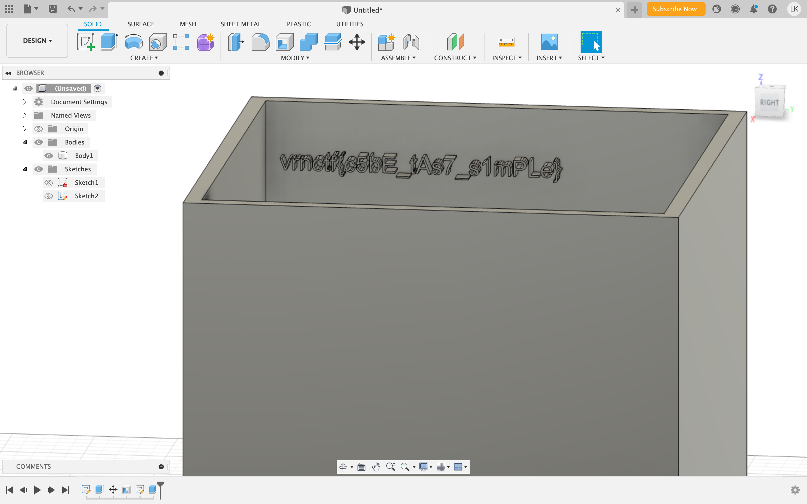

# Куб-компаньон

## Информация 

> "Поместите экспериментальный утяжеленный грузовой куб на 1500-мегаваттную экспериментальную сверхпрочную сверхударную сверхкнопку."

## Деплой

Static 

## Выдать участникам

Файл объекта папки *public*

## Описание

Дан текстовый файл. По его структуре можно понять, что это 3д объект, описанный треугольниками - 
вертексами. Подобный формат - это stl. Можно посмотреть в любом просмотрщике 3д объектов. 

## Решение 

Объект на самом деле полый. Можно скачать либо САПР, либо программу Cura для нарезки моделей для 
3д принтера, нарезать и посмотреть по слоям. На одной из стенок "выбит" флаг

## Флаг

`vrnctf{c5bE_tAs7_s1mPLe}`

